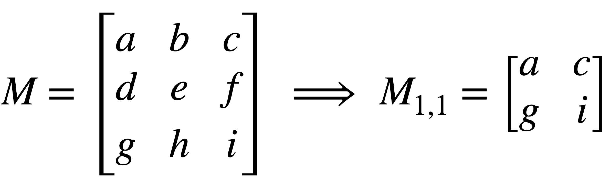
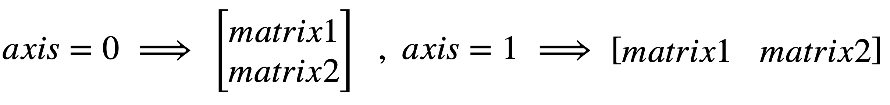
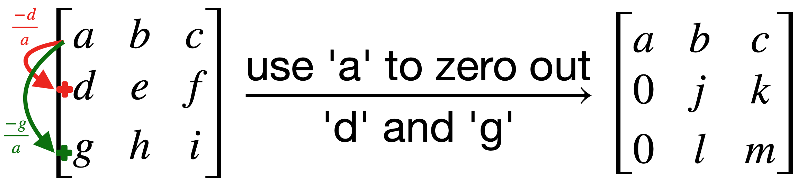
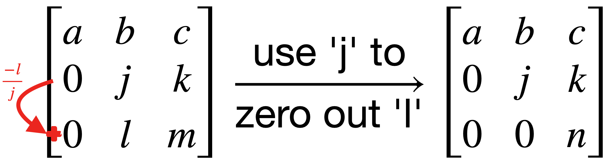

# Advanced Programming - HW1
<p  align="center"> <b>Homework 1 - Spring 2022 Semester <br> Deadline: Sunday Esfand 1st - 11:59 pm</b> </p>

## Outline

In this homework we are going to implement a **Linear Algebra** library for c++. 
In this library we are going to implement different functions to allow our users to easilly work and manipulate different **matrices**.
We will be implementing all our functions in `hw1.cpp` and `hw1.h`. remember you should put all declarations in the `.h` and all the implementations in the `.cpp` file.
In order to have a matrix in c++ we need a 2D vector.  We use the following line in order to reduce our syntax. 
```cpp
using Matrix = std::vector<std::vector<double>>;
```
From now on we can use the keyword **Matrix** instead of defining the 2D vector everytime.
So, go ahead and put the above line in your code.

**note.** Define all your functions in a namespace called `algebra`.


# Functions
Now, lets discuss each functions and see how they should be implemented. 

 - **zeros**
implement this function so that it will create a `n x m`  matrix with all elements equal to zero.
	```cpp
	Matrix zeros(size_t n, size_t m)
	```

 - **ones**
implement this function so that it will create a `n x m`  matrix with all elements equal to one.
	```cpp
	Matrix ones(size_t n, size_t m)
	```

 - **random**
implement this function so that it will create a `n x m`  matrix with all elements a random number between `min` and `max`.
	```cpp
	Matrix random(size_t n, size_t m, double min, double max)
	```
	**note.** to generate a random number you are not allowed to use `rand` and `srand` functions. instead, use the `<random>` library first introduced in c++11.


- **show**
implement this function so that it will display the matrix in a beautiful way.
    ```cpp
    void show(const Matrix& matrix)
    ```
    **note.** to display your matrices use the `<iomanip>` library. when showing the numbers, each element of the matrix should have exactly 3 decimal places.


- **multiply** - *scalar number*

  implement this function so that it multiplies the `matrix` into the constant scalar `c`.
    ```cpp
    Matrix multiply(const Matrix& matrix, double c)
    ```
	
- **multiply** - *matrix*

  implement this function so that it multiplies the `matrix1` into `matrix2`. (this is **not** an element-wise multiplication)
    ```cpp
    Matrix multiply(const Matrix& matrix1, const Matrix& matrix2)
    ```

- **sum** - *scalar number*

  implement this function so that it adds the constant number `c` to every element of `matrix`.
    ```cpp
    Matrix sum(const Matrix& matrix, double c)
    ```
	
- **sum** - *matrix*

  implement this function so that it adds 2 matrices to each other.
    ```cpp
    Matrix sum(const Matrix& matrix1, const Matrix& matrix2)
    ```

- **transpose**
implement this function so that it will generate the transpose matrix of the input `matrix`.
    ```cpp
    Matrix transpose(const Matrix& matrix)
    ```

- **minor**
implement this function so that it will create the minor of the input `matrix` with respect to n<sup>th</sup> row and m<sup>th</sup> column.
    ```cpp
    Matrix minor(const Matrix& matrix, size_t n, size_t m)
    ```
    **note.** the indices in c++ start from 0 ~~not 1~~, for example:

    <br>
    <p align="center">
    
    </p>
    <br>

- **determinant**
implement this function so that it calculates the determinant of the input `matrix`. 
    ```cpp
    double determinant(const Matrix& matrix)
    ```
    *you should only use the minor approach to calculate the determinant, any other methods (such as upper-triangular or ...) is not allowed.*
	

- **inverse**
implement this function so that it generates the `matrix`'s inverse. 
	```cpp
	Matrix inverse(const Matrix& matrix)
	```

- **concatenate**
implement this function so that it will concatenate `matrix1` and `matrix2` along the specified axis. (`axis=0`: on top of each other | `axis=1`: alongside each other). 
	```cpp
	Matrix concatenate(const Matrix& matrix1, const Matrix& matrix2, int axis=0)
	```

    <br>
    <p align="center">
    
    </p>
    <br>
	

- **elementary row operations**
we  want to implement elementary row operation (ERO) functionality for our library. as you know we have 3 EROs:

  `1)`swapping two rows.

  `2)`multiplying a row into a constant number.

  `3)`multiplying a row into a constant number and add it to another row.

  So, lets define the following 3 functions to do this.
    - **swap**
    swaps r<sub>1</sub><sup>th</sup> row with  r<sub>2</sub><sup>th</sup>.
        ```cpp
        Matrix ero_swap(const Matrix& matrix, size_t r1, size_t r2)
        ```
		
    - **multiply**
    multiplies every element in r<sup>th</sup> row with constant number `c`.
        ```cpp
        Matrix ero_multiply(const Matrix& matrix, size_t r, double c)
        ```

    - **sum**
    adds &emsp; r<sub>1</sub><sup>th</sup> x c &emsp; into r<sub>2</sub><sup>th</sup> row.
        ```cpp
        Matrix ero_sum(const Matrix& matrix, size_t r1, double c, size_t r2)
        ```

- **upper triangular**
implement this function so that it will calculate the upper triangular form of the `matrix` using the ERO operations.
    ```cpp
    Matrix upper_triangular(const Matrix& matrix)
    ```
    **note.** to make a upper triangular matrix you have to zero out all the elements which are below the main diagonal, using the elemnts on the main diagonal. consider the following example:
    <br/>
    <br/>
    <p align="center">
    
    </p>
      <br/>
    <br/>
  
    use the same trick to zero out `l`, using `j` like the following.
  	
    <br/>
    <br/>
    <p align="center">
    
    </p>
      <br/>
      <br/>
  
    ***bonus question** what happens if we come across a zero on our main diagonal for example `a` or `j` in the example above? solve this problem.*

    *The last unit-test is for the bonus question. don't worry too much if it fails.*
	

# Cautions
- Whenever you are defining a function you should always consider every aspect of its usage. in this homework you are writing a library, so it can be used by others. so you should keep in mind they may not always use your functions properly. for example, they may try to calculate the invert of a non-singular matrix, or they may try to multiply two matrices with incorrect dimensions.
You should keep track of these misbehaviours that may happen in your functions and throw a `logic error` in these cases.
if you are not familiar of how to throw errors just try to google it. don't worry it will be the simplest part of the homework :stuck_out_tongue_winking_eye:
- other than logic errors you should consider that the users may try to use empty matrices with your functions. (for example the determinant of an empty matrix is 1). keep this in mind in all your implementations.

# Finally
As mentioned before, keep all your implementations in `hw1.cpp` and `hw1.h`. do not alter other files at all. In case you want to test your code you may only use the `debug` section of the `main.cpp` which will be explained in the TA class.

```cpp
if (true) // make false to run unit tests  
{ 
	// debug section 
}  
else  
{  
	::testing::InitGoogleTest(&argc, argv);  
	std::cout << "RUNNING TESTS ..." << std::endl;  
	int ret{RUN_ALL_TESTS()};  
	if (!ret)  
		std::cout << "<<<SUCCESS>>>" << std::endl;  
	else  
	  std::cout << "FAILED" << std::endl;  
}  
return 0;
```
<br/>
<p  align="center"> <b>GOOD LUCK</b> </p>
